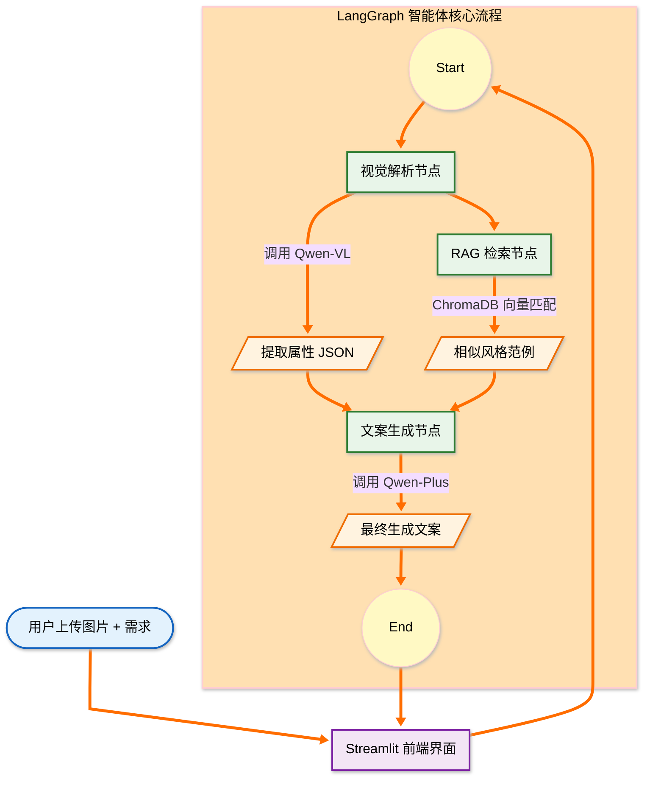

# E-ComMate：多模态电商营销文案自动化生成 Agent

[](https://huggingface.co/spaces/[你的用户名]/[你的Space名称])


> **项目背景**：E-ComMate 是一个基于 **LangGraph** 工作流编排与 **Qwen-VL** 多模态大模型的智能电商营销助手。它能够“看懂”商品图片，并结合 **RAG** 风格知识库，一键生成小红书、朋友圈、京东等特定风格的爆款文案。

---

## 项目演示 (Live Demo)

### [点击这里在线体验 (Hugging Face Spaces)](https://daphne502-e-commate.hf.space)

**示例商品图片：**


**在线视频演示：**
[](https://www.bilibili.com/video/BV1WRf3BHEDK?t=0.0)

---

## 核心痛点与解决方案

在电商营销场景中，我们解决了以下核心问题：

| 核心痛点 | E-ComMate 解决方案 | 技术支撑 |
| :--- | :--- | :--- |
| **视觉理解缺失** | AI 不再瞎编，而是精准识别商品的颜色、材质、版型等细节。 | **Qwen-VL-Max** (多模态大模型) |
| **风格同质化** | 拒绝千篇一律，支持“小红书种草”、“朋友圈私域”、“京东硬广”等多种文风切换。 | **RAG** (检索增强生成) + **ChromaDB** |
| **流程不可控** | 将视觉解析、风格检索、文案生成解耦，实现可控、可调试的 Agent 工作流。 | **LangGraph** (状态机编排) |

---

## 系统架构 (Architecture)

本项目采用模块化设计，数据流向如下：



## 技术栈 (Tech Stack)

- 大模型基座 (LLM):
  - 文本生成: Aliyun Qwen-Plus (通义千问)
  - 视觉理解: Aliyun Qwen-VL-Max
  - 向量嵌入: Text-Embedding-V1
- Agent 编排: LangChain / LangGraph (StateGraph)
- RAG 知识库: ChromaDB (本地向量存储)
- 前端交互: Streamlit (流式输出模拟、多模态 Session 管理)
- 工程化: Pydantic (数据校验), Dotenv (环境管理), Hugging Face Spaces (云端部署)

## 📂 目录结构

```text
E-ComMate/
├── main.py                 # Streamlit 前端入口 (UI逻辑与Session管理)
├── config.py               # 全局配置中心 (环境变量读取)
├── requirements.txt        # 项目依赖库列表
├── core/                   # [核心逻辑层]
│   ├── workflow.py         # LangGraph 图编排 (Agent 状态机定义)
│   ├── vision.py           # 视觉解析模块 (Prompt Engineering + Output Parser)
│   ├── rag.py              # 向量检索模块 (ChromaDB + Embedding)
│   └── llm.py              # 模型初始化封装
├── data/
│   ├── styles.csv          # 文案风格原始数据 (小红书/朋友圈/电商)
│   └── chroma_db/          # 自动生成的本地向量索引 (运行后生成)
└── assets/                 # 静态资源 (测试图片、截图)
```

## 开发日志 (Dev Log)

**v1.0 (MVP):** 基础设施搭建，通过 OpenAI 兼容接口跑通 Qwen-Plus。
**v1.1 (Vision):** 攻克了 Qwen-VL 模型不支持 Tool Call 的问题，采用 Prompt 结构化工程实现 JSON 输出。
**v1.2 (RAG):** 引入 ChromaDB，实现基于语义的风格检索 (Semantic Search)。
**v1.3 (Agent):** 使用 LangGraph 重构逻辑，串联 Vision -> RAG -> Generate 工作流。
**v1.4 (UI):** 搭建 Streamlit 前端界面，实现流式输出模拟 `Streaming Simulator`，并增加对非商品图的防幻觉过滤。
**v1.5 (Core Fix):** 攻克 Streamlit DOM 渲染报错 `removeChild Error`，重构图片缓存机制 (BytesIO) 彻底解决跨会话丢失问题。
**v1.6（Feat）：** 新增了 “对话框关键词约束” 功能，侧边栏 “清空历史对话” 功能
**v2.0 (Release):** 优化 UI 状态反馈逻辑，完成 Hugging Face Space 部署。

> *Designed by [Daphne502] - 2026*
